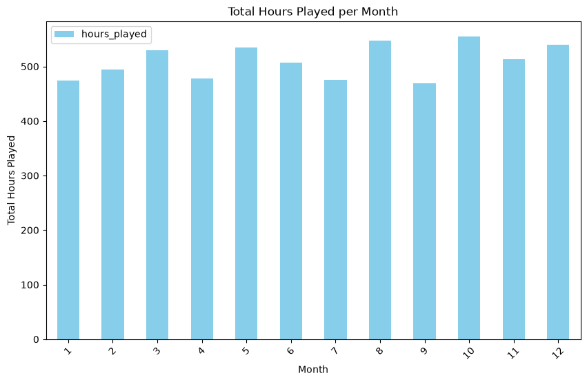
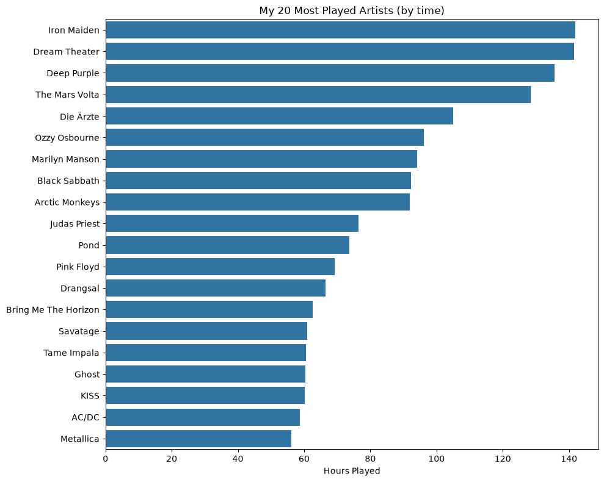
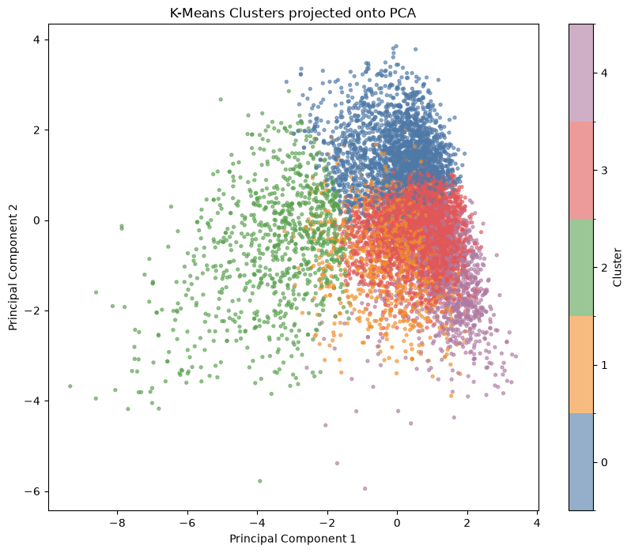
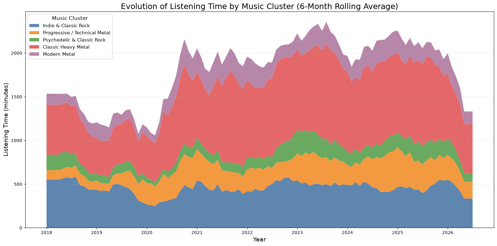
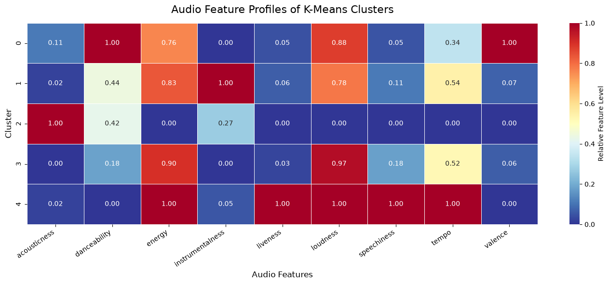

# Spotify Taste Analysis

Analyze personal Spotify listening habits using data science and machine learning.

## Overview

This project analyzes my personal Spotify streaming history using exploratory data analysis, audio features, dimensionality reduction, and unsupervised machine learning.

The goal is not simply to identify my most-played artists and songs, but to uncover broader patterns in how my musical preferences have evolved over time.

## Questions

* How has my listening behavior changed over time?
* Which musical characteristics define my listening habits?
* Can my listening history be grouped into meaningful musical clusters?
* How have these musical clusters evolved over time?
* Which artists are most representative of each cluster?

## Data

The analysis is based on my personal Spotify streaming history, covering multiple years of listening activity.

The dataset contains information such as:

* Track and artist
* Timestamp
* Listening duration
* Playback information
* Audio features retrieved from Spotify

Personal raw Spotify data is not included in this repository.

## Analysis

The project is organized into several stages.

### 1. Data Collection & Cleaning

Loading, combining, and cleaning the Spotify streaming history and preparing the data for analysis.

### 2. Exploratory Data Analysis

Exploring listening behavior over time, including:

* Most-played artists and songs
* Listening time
* Temporal patterns
* Changes in listening habits

#### Listening Time Over Time

The following visualization shows the total listening time per month and provides an overview of changes in listening activity over the course of the dataset.



#### Evolution of Favorite Artists

This visualization shows how the most-played artists have changed over time, highlighting shifts in musical preferences and periods dominated by different artists.



### 3. Audio Feature Analysis

Analyzing the musical characteristics of the tracks in the listening history.

Audio features are used to describe different aspects of the music and provide a basis for comparing tracks beyond artist or genre labels.

### 4. Machine Learning

Using dimensionality reduction and K-Means clustering to identify groups of songs with similar musical characteristics.

The resulting clusters are interpreted using their audio features, listening behavior, and representative artists.

## Results

### Musical Clusters

The clustering analysis identified five distinct musical profiles:

* **Indie & Classic Rock**
* **Progressive / Technical Metal**
* **Psychedelic & Classic Rock**
* **Classic Heavy Metal**
* **Modern Metal**

These clusters provide a more nuanced picture of my musical taste than simple artist or genre rankings.

### PCA Projection

Principal Component Analysis (PCA) was used to reduce the dimensionality of the audio feature space and visualize the resulting musical clusters.

Each point represents a track, with colors indicating its assigned musical cluster.



The separation of the clusters illustrates that the identified groups correspond to distinct combinations of musical characteristics rather than simply reflecting individual artists.

### Evolution of Musical Clusters

The following visualization shows how listening time has evolved across the identified musical clusters over time.



This connects the machine learning results with the temporal analysis and shows how the relative importance of different musical profiles has changed throughout the listening history.

### Cluster Audio Features

The average audio features of the clusters provide an additional way to interpret the musical profiles identified by the clustering algorithm.



The heatmap highlights the characteristic differences between the clusters and helps explain why the groups are musically distinct.

## Project Structure

```text
spotify-taste-analysis/
├── data/
├── notebooks/
│   ├── 01_data_collection.ipynb
│   ├── 02_exploratory_analysis.ipynb
│   ├── 03_audio_features.ipynb
│   ├── 04_machine_learning.ipynb
│   └── artist_logo_collage.ipynb
├── src/
├── figures/
├── README.md
├── requirements.txt
└── LICENSE
```

## Technologies

* Python
* pandas
* NumPy
* scikit-learn
* Matplotlib
* Plotly
* Jupyter Notebook

## Future Ideas

Possible extensions include:

* Artist visualizations for each musical cluster
* More detailed analysis of representative artists
* Changes in musical taste across different periods
* Comparison of listening behavior with audio features
* Further exploration of temporal patterns in listening behavior

## License

This project is licensed under the MIT License.
